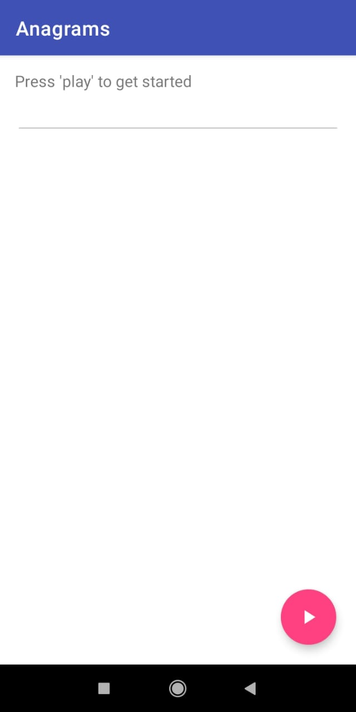
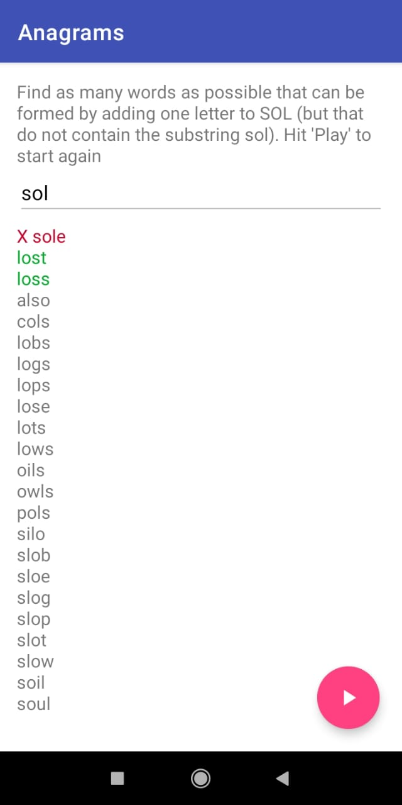

### Anagrams
A word game wherein the player has to find as many words as possible that can be formed by adding one letter to the given word but that do not contain the former as a substring.

#### _App Screenshots_
|||
|---|---|

#### _Data structures used_
HashMap and HashSet

#### _Remarks_
This project is a part of [Applied CS skills in Android](https://appliedcsskills.withgoogle.com "Go to Website") course offered by Google.
